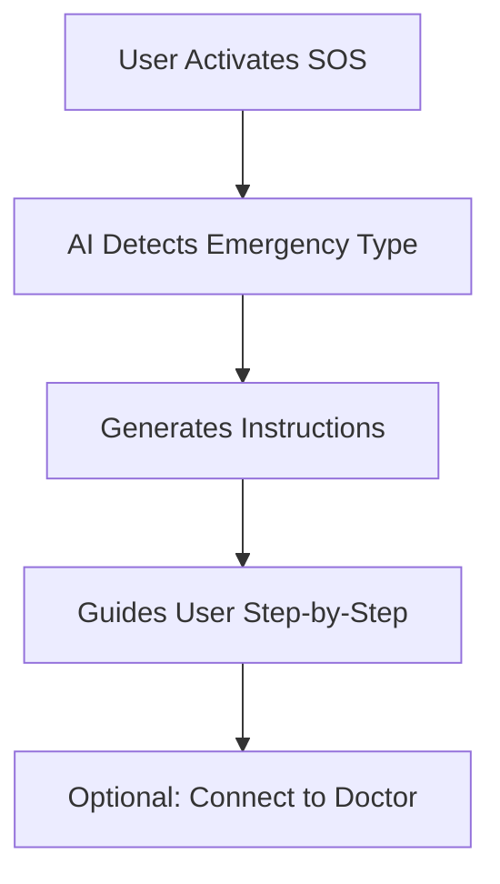

# 🚑 ResQAI — AI-Powered Emergency Response Assistant

<p align="center">
  <b>Saving Lives with AI-Powered Real-Time Emergency Guidance</b><br/>
</p>

<p align="center">
  
  
  
</p>

---

## 🔥 Live Demo

🚀 https://your-live-link.vercel.app *(Update after deployment)*

---

## 📌 Problem

In emergency situations:

* People panic 😰
* Lack of medical knowledge ❌
* Incorrect actions can worsen conditions ⚠️

⏱️ The first few minutes are critical — but help is often delayed.

---

## 💡 Solution — ResQAI

ResQAI is an **AI-powered emergency assistant** that:

* Provides **real-time step-by-step guidance**
* Helps **bystanders act correctly**
* Bridges the gap until **professional medical help arrives**

---

## ✨ Key Features

### 🆘 Smart SOS System

* One-click emergency activation
* Instant response guidance

### 🧠 AI Decision Engine

* Detects emergency scenarios
* Generates structured instructions

### 📖 Guided Assistance

* CPR guidance
* First aid instructions
* Situation-specific help

### 🎥 Real-Time Doctor Assist *(Planned)*

* Video call integration
* Expert support

### 🌐 Clean & Accessible UI

* Designed for high-stress situations
* Minimal, fast, and intuitive

---

## 🧪 Tech Stack

| Layer      | Technology                     |
| ---------- | ------------------------------ |
| Frontend   | React.js / HTML / Tailwind CSS |
| Backend    | Firebase / Node.js             |
| AI Layer   | NLP / LLM APIs                 |
| Deployment | Vercel / Netlify               |

---

## 🧠 How It Works



---

## 📸 Screenshots

> ⚠️ Add these (VERY IMPORTANT)

* Home Page
* SOS Activation Screen
* Instruction Interface

---

## 🚀 Installation

```bash
git clone https://github.com/Sowmya-21/ResQAI--AI-Powered-Emergency-Response-Assistant.git
cd ResQAI--AI-Powered-Emergency-Response-Assistant
npm install
npm start
```

---

## 🧠 System Design (Interview Perspective)

### 🏗️ Architecture

* **Frontend (React)** → UI & user interaction
* **AI Layer** → Emergency decision engine
* **Backend** → Data + real-time handling
* **Communication Layer** → Future doctor connection

---

### ⚡ Data Flow

1. User activates SOS
2. Input sent to AI engine
3. AI identifies emergency type
4. Generates step-by-step response
5. UI displays actionable guidance

---

### 🧩 Core Modules

* Emergency Detection Module
* Instruction Generator
* User Interaction Layer
* Real-Time Communication (Planned)

---

## 🎯 Challenges & Solutions

| Challenge        | Solution                             |
| ---------------- | ------------------------------------ |
| Panic situations | Simple, guided UI                    |
| Slow response    | Lightweight architecture             |
| User confusion   | Structured step-by-step instructions |

---

## ⚙️ Scalability & Optimization

* Cloud-ready architecture ☁️
* Modular design 📦
* Fast API responses ⚡
* Extendable to real-time systems 🔄

---

## 🔐 Security Considerations

* Secure API handling
* Future authentication integration
* Safe user data handling

---

## 📊 Impact

* ⏱️ Reduces emergency response time
* 🧠 Assists untrained individuals
* ❤️ Potential to save lives

---

## 🔮 Future Scope

* 📞 Live doctor video calls
* 📡 Bluetooth mesh communication (offline emergencies)
* 🌍 Multilingual AI support
* 🤖 Advanced AI diagnosis
* 🚑 Auto ambulance integration

---

## 🏆 Hackathon Value

✔ Real-world problem solving
✔ AI + healthcare integration
✔ Scalable architecture
✔ Strong product thinking

---

## 🎤 Interview Pitch

**1-Line:**
"ResQAI is an AI-powered system that provides real-time emergency guidance to help users take correct actions before medical help arrives."

**30-sec Explanation:**
"I developed a React-based application integrated with an AI decision engine that analyzes emergency scenarios and generates structured, step-by-step instructions. The system is optimized for usability under stress and designed to scale with real-time communication features."

---

## 🧠 Learnings

* Real-world system design
* AI integration in applications
* UI/UX for critical scenarios
* Scalable architecture thinking

---

## 👩‍💻 Author

**Sowmya Kanaparthi**
🎓 B.Tech IT
💻 Aspiring Software Engineer | AI Enthusiast

---

## 🌟 Support

If you like this project:
⭐ Star the repo
🍴 Fork it
🚀 Share it

---

## 📄 License

This project is licensed under the MIT License.
